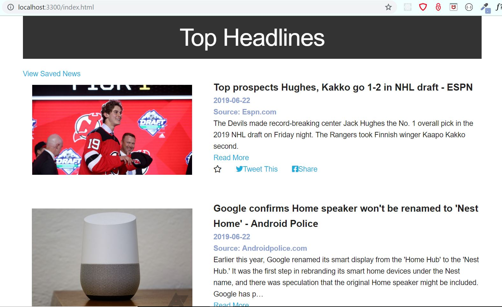
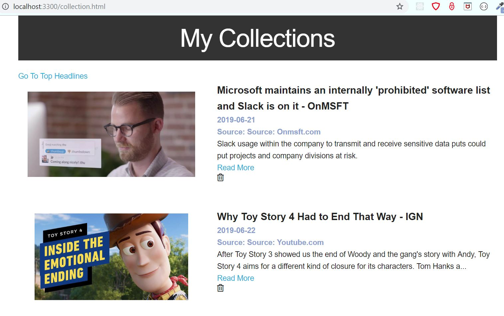
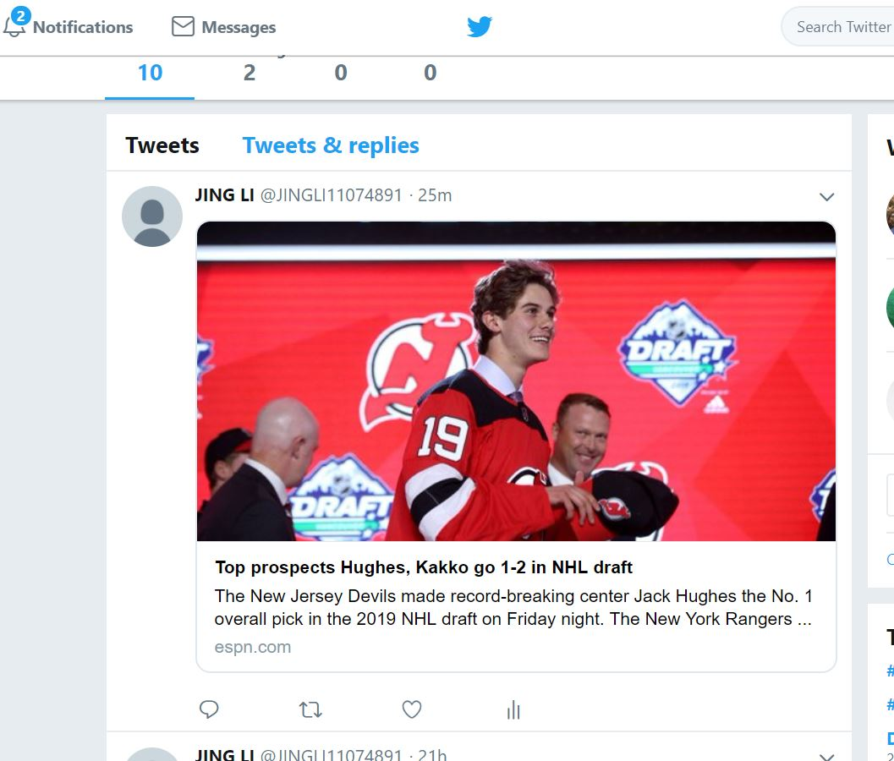
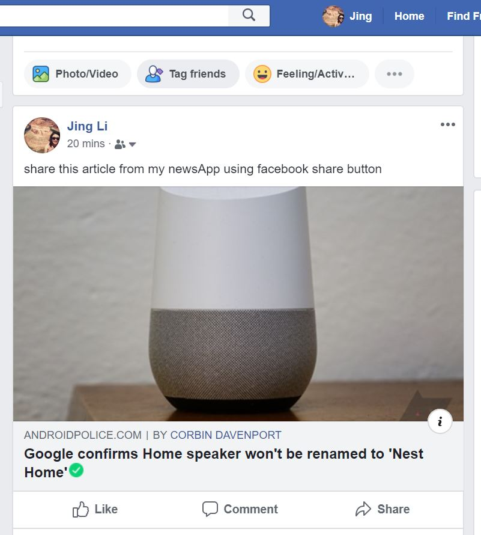

# Project Title

NewsApp

# Project Description

This is an application that displays top headlines news from the NewsAPI. A user can read a news, save it to the user's own collections, share it on Twitter or Facebook.






# Tech Tools Used

- node.js
- express
- mongoDB Atlas
- dotenv
- axios
- NewsAPI, Twitter API, Facebook Social Plugins

# Installation

```
npm install
```

**To run this application, a .env file needs to be setup in the root directory with the authentication credentials.**
